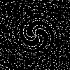
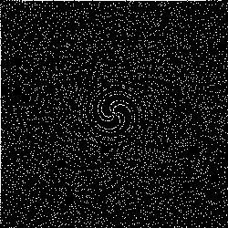
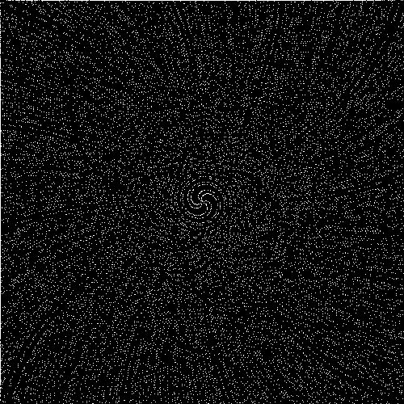
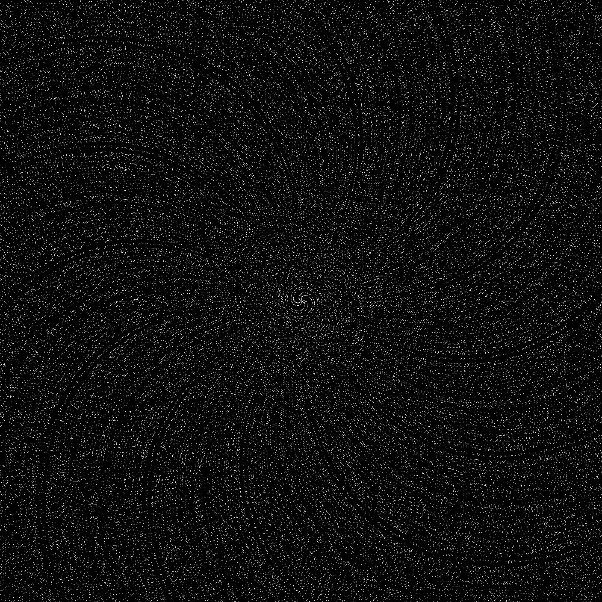

# cpp-playground

## 🇮🇩 Bahasa Indonesia

Kumpulan eksperimen dan kode C++ sebagai hasil eksplorasi dan latihan. Beberapa proyek mungkin belum selesai, jadi harap dimaklumi. Untuk proyek manipulasi gambar PNG, Anda perlu menginstal **libpng** sesuai sistem operasi Anda.

### 🎨 Proyek Terkini
- **Prime Art**: Visualisasi angka prima dalam bentuk spiral:
  1. `100 × 100` 
  2. `250 × 250` 
  3. `500 × 500` 
  4. `1000 × 1000` 

### 📂 Struktur Direktori
```
.
├── .github/
│   └── workflows/
├── 3D/
├── NN/
├── basic/
├── electrical/
│   └── component/
├── image/
├── number_system/
├── .gitignore
├── CMakeLists.txt
├── LICENSE
├── init-cmake.sh
├── prime-spiral-100-100.png
├── prime-spiral-250-250.png
├── prime-spiral-500-500.png
└── prime-spiral-1000-1000.png
```

### 📁 Deskripsi Folder
- `3D/`                     Eksperimen pemrograman 3D.
- `NN/`                     Implementasi Neural Network dari nol.
- `basic/`                  Sintaks dasar C++.
- `electrical/`             Simulasi elemen elektronik.
  - `component/include/`    Header file untuk komponen elektronik.
- `image/`                  Pengolahan dan manipulasi gambar.
- `number_system/`          Sistem bilangan.

### 🚀 Kompilasi
**Persyaratan:**
- Kompiler C++20 (g++, clang++).
- CMake (opsional).
- **libpng** untuk proyek image/PNG.

```bash
g++ -std=gnu++20 ...
```
atau
```bash
clang++ -std=c++20 ...
```
atau menggunakan CMake:
```bash
cmake -S . -B build
cmake --build build
```

### 🤝 Kontribusi
Ingin kontribusi? Silakan! Kalau tidak, juga tidak masalah. Proyek ini hanya untuk latihan kok.

### 📜 Lisensi
Proyek ini dilisensikan di bawah **GPL v3 License**. [Baca detailnya di sini](LICENSE).
