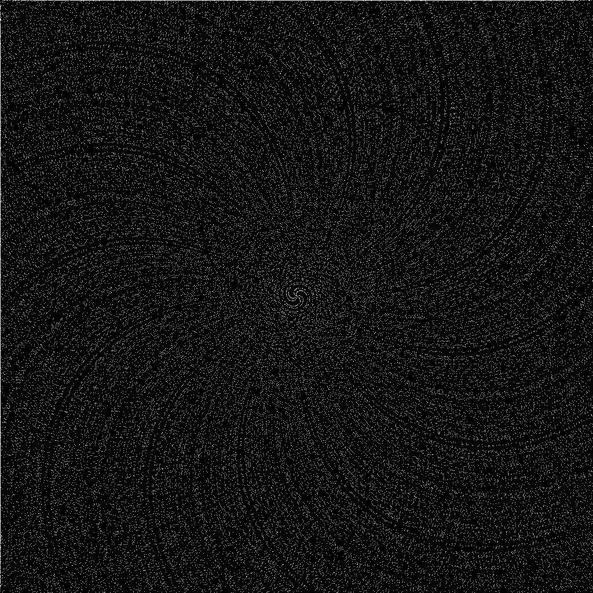

# cpp-playgroun
[README.md Bahasa Indonesia](README-id.md)

## 🇺🇸 English

A collection of C++ experiments and code created as part of exploration and practice. Some projects might still be incomplete, so please bear with it. For PNG image manipulation, you need to install **libpng** based on your operating system.

### 🎨 Recent Projects
- **Prime Art**: Visualization of prime numbers in a spiral:
  1. `100 × 100` 
  2. `1000 × 1000` 
  3. `1024 × 1024` 
  4. `10240 × 10240` 

### 📂 Directory Structure
```
.
├── .github/
│   └── workflows/
├── 3D/
├── NN/
├── basic/
├── electrical/
│   └── component/
├── image/
├── number_system/
├── .gitignore
├── CMakeLists.txt
├── LICENSE
├── init-cmake.sh
├── prime-spiral-100-100.png
├── prime-spiral-1000-1000.png
├── prime-spiral-1024-1024.png
└── prime-spiral-10240-10240.png
```

### 📁 Folder Descriptions
- `3D/`                     3D programming experiments.
- `NN/`                     Neural Network implementation from scratch.
- `basic/`                  Basic C++ syntax.
- `electrical/`             Simulations of electronic elements.
  - `component/include/`    Header files for electronic components.
- `image/`                  Image processing and manipulation.
- `number_system/`          Number systems.

### 🚀Compilation
**Requirements:**
- C++20 compiler (g++, clang++).
- CMake (optional).
- **libpng** for image/PNG projects.

```bash
g++ -std=gnu++20 ...
```
or
```bash
clang++ -std=c++20 ...
```
or using CMake:
```bash
cmake -S . -B build
cmake --build build
```

### 🤝 Contributions
Want to contribute? Feel free! If not, that's fine too. This is a practice project.

### 📜 License
This project is licensed under the **GPL v3 License**. [Read more here](LICENSE).
