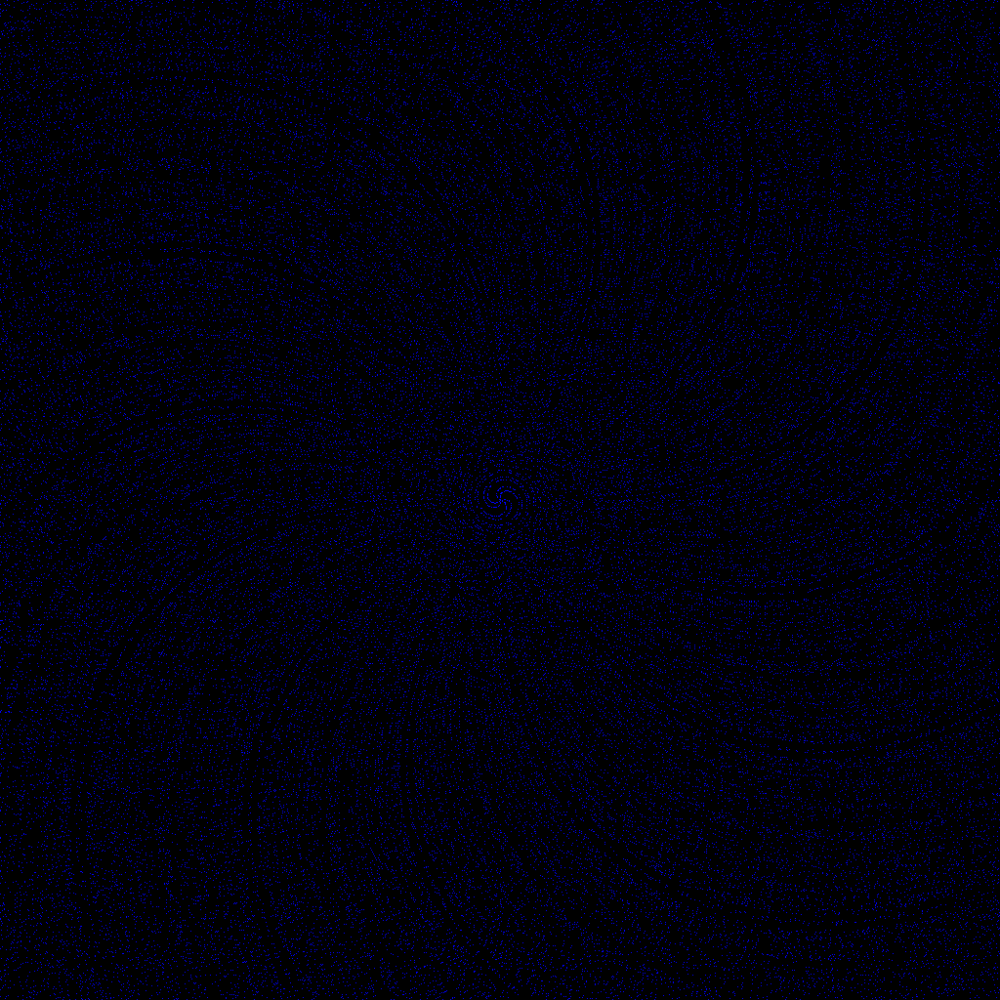

# cpp-playground

Kumpulan eksperimen dan kode kode C++ hasil gabut dan latihan.
Beberapa masih belum selesai sih, tapi ya begini adanya. Untuk project image png perlu libpng, jadi install dulu sesuai OS masing masing

## Overview
- `some prime art`
  1. `prime spiral 100 × 100 png` 
  2. `prime spiral 1000 × 1000 png` 
  3. `prime spiral 1024 × 1024 png `
  4. `prime spiral 10240 × 10240 png`


## Struktur Direktori

```
.
├── .github/
│   └── workflows/
├── 3D/
├── NN/
├── basic/
├── electrical/
│   └── component/
├── image/
├── number_system/
├── .gitignore
├── CMakeLists.txt
├── LICENSE
├── init-cmake.sh // cmake only
├── prime-spiral-100-100.png
├── prime-spiral-1000-1000.png
├── prime-spiral-1024-1024.png
└── prime-spiral-10240-10240.png
```

## Deskripsi Folder

* `3D/`                     Eksperimen 3D
* `NN/`                     Implementasi neural network dari nol
* `basic/`                  sintaks dasar C++
* `electrical/`             Simulasi elemen elektronik nyata

  * `component/include/`    Header file untuk komponen elektronik
* `image/`                  Pengolahan dan manipulasi gambar
* `number_system/`          Sistem bilangan

## Run

Prerequisites:

* Compiler C++20 (g++, clang++)
* CMake (opsional)
* libpng untuk build projek image/PNG

Kompilasi dan cara jalanin:

```bash
  g++ -std=gnu++20 ...
```

Atau
```bash
  clang++ -std=c++20 ...
```

Atau pake CMake:

```bash
  cmake -S . -B build
  cmake --build build
```

## Kontribusi

Mau kontribusi silahkan, ga ya silahkan. Orang projek latihan doang

## Lisensi

GPL V3 License.[CEK DISINI](LICENSE).

